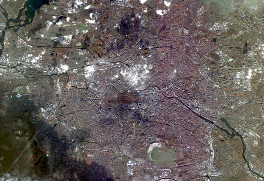

# Example on how to query and order using the UP42 API

## Introduction

This document presents an example top to bottom, how to query and
place orders for both immediately and cold storage (archived) images.

## 0. Installation


 0. Requirements

 + [Bash](https://en.wikipedia.org/wiki/Bash_(Unix_shell)).
 + [cURL](https://curl.haxx.se).
 + [jq](https://stedolan.github.io/jq/).
 + [jwt-cli](https://github.com/mike-engel/jwt-cli).
 + [GNU core utilities](https://www.gnu.org/software/coreutils/coreutils.html)
   &mdash; recommended, not mandatory.
 + [uuid](http://www.ossp.org/pkg/lib/uuid/).

 1. Clone the repository:
 ```bash
git clone https://github.com/up42/api-explorer.git
```
 2. Create an alias: add to your Bash aliases the alias.
```bash
alias up42='/path/to/api-explorer/up42.sh'
```
 3. Source the alias.
```bash
source ~/.bashrc
```
 4. Done.

## 1. Configuration: setup the project key and project ID

You need to setup a file with the project ID and project API key, like
this:

```js
{
  "project_id": "<projetc ID>",
  "project_api_key": "<project API key>"
}
```

You can create a **default** configuration file, named
`project_default.conf` at the `~/.up42/` directory. This directory
will be created by the script if doesn't exist. Alternatively you can
pass the configuration file as an argument to the script with the
option `-c`. E.g.,

```bash
up42.sh -f search -b search_params.json -c my_project.conf
```

Here we are passing a configuration file `my_project.conf`.

## 2. Getting help

To get an overview of all the available command options just do:

```bash
up42
```

To get a list of the available operations:

```bash
up42 -f list-operations
```

## 3. Perform a Pléiades full archive search

### 3.1 Searching

This search is made across immediately available images and also
images in cold storage that need to be warmed up to be obtained
(downloaded or streamed via WMTS).

```bash
up42 -f search -b search_params.json
```

Here is an example `search_params.json`:

```js
{
  "intersects": {
    "type": "Polygon",
    "coordinates":  [
          [
            [
              13.42855453491211,
              52.51261676798259
            ],
            [
              13.436279296875,
              52.51262982683484
            ],
            [
              13.436279296875,
              52.51525457735388
            ],
            [
              13.42855453491211,
              52.51525457735388
            ],
            [
              13.42855453491211,
              52.51261676798259
            ]
          ]
        ]
  },
  "limit": 100,
  "query": {
    "cloudCoverage": {
      "lte": 20
    },
    "processingLevel": {
      "IN": [
        "ALBUM",
        "SENSOR"
      ]
    },
    "dataBlock": {
      "in": [
        "oneatlas-pleiades-fullscene",
        "oneatlas-pleiades-aoiclipped"
      ]
    }
  },
  "datetime": "2016-01-01T00:00:00.000Z/.."
}
```

Where:

 * `processingLevel`: specifies **both** cold (`ALBUM`) and warm (immediately
   available images, `SENSOR`).

 * `dataBlock`: specifies which data blocks are targeted for the search. In this case
   only Pléiades data blocks.

The remainder fields in the JSON follow the
   [STAC](https://stacspec.org/STAC-api.html#operation/getSearchSTAC)
   specification.

If you want to have a nicely formatted output saved to a file do:

```bash
up42 -f search -b search_params.json | jq '.' > search_results.json
```

### 3.2 Inspect the search results

You can use `jq` to inspect the results.

 1. Get all scene IDs of `ARCHIVED` (cold storage) images.
```bash
jq -r '.features[].properties.providerProperties as $p | if $p.productionStatus=="ARCHIVED" then $p.sourceIdentifier else empty end' search_results.json
```
 2. Get all images IDs that are `ARCHIVED` (cold storage): these IDs
    will be then  used
    for ordering and getting the quicklooks.
```bash
jq -r '.features[].properties as $p | if $p.providerProperties.productionStatus=="ARCHIVED" then $p.id else empty end'
```
 3. Get all scene IDs of `ON_CLOUD` (immediately available) images.
```bash
jq -r '.features[].properties.providerProperties as $p | if $p.productionStatus=="IN_CLOUD" then $p.sourceIdentifier else empty end' search_results.json
```
 4. Get all images IDs that are `ON_CLOUD` (immediately available)
    images. These IDs are used for ordering and getting the quicklooks.
```bash
jq -r '.features[].properties as $p | if $p.providerProperties.productionStatus=="IN_CLOUD" then $p.id else empty end'
```

## 2. Get the quicklooks for a given image

After obtaining the search results you can now get a low resolution
preview of an image listed in the search results. For that you need
the **image ID**. This is an unique identifier for a particular image.

### 2.1 Build a CSV file of archived images

Let us build a CSV of archived images using `jq`:

```bash
jq -r '.features[].properties as $p | if $p.providerProperties.productionStatus=="ARCHIVED" then $p.providerProperties.sourceIdentifier + ","+ $p.id else empty end' examples/search_results.json > archived_images.csv
```
This CSV has: scene ID, image ID.

```
DS_PHR1A_202011231024316_FR1_PX_E013N52_0513_01258,2e09def0-4625-4d79-8d4d-1a21f6d15d06
DS_PHR1A_202011161028060_FR1_PX_E013N52_0513_01258,00f41695-ec28-49e5-93cd-8b0cf1257988
DS_PHR1B_202011081039094_FR1_PX_E013N52_0413_00881,8187d56c-601a-461b-95c9-0bf2c8eb06ed
DS_PHR1B_202011051013101_FR1_PX_E013N52_0513_00974,d6d73f7c-e587-4c9a-9c54-7d1ab44e9384
DS_PHR1A_202011041020454_FR1_PX_E013N52_0513_01258,c06cee4b-fa16-4d25-b311-b3cf40263d86
DS_PHR1A_202006011019179_FR1_PX_E013N52_0614_01578,bb8cc2e8-dbd8-46fa-bcb2-95f8afe70b8d
DS_PHR1B_202004281031350_FR1_PX_E013N52_0513_01239,f53ee788-e20d-4fb0-94d1-a7f9e96a5ba4
DS_PHR1B_202004281031230_FR1_PX_E013N52_0612_02694,804c50f2-4093-4b85-ab84-e328b8fc47f1
DS_PHR1B_202004231019525_FR1_PX_E013N52_0513_01239,3c89938c-e669-4525-959b-62ba46c904e2
DS_PHR1A_202004181056599_FR1_PX_E013N52_0513_01048,b05e9f94-867c-4894-a27f-992b6fac3cb8
DS_PHR1A_202004171016453_FR1_PX_E013N52_0513_01088,9974c6c0-11c3-4e92-87a6-85ea4e5cdce3
DS_PHR1B_202004161023163_FR1_PX_E013N52_0513_01124,6c796740-0839-4ce0-80c7-b18564771687
DS_PHR1B_202004121053125_FR1_PX_E013N52_0513_01032,a33af54d-5c24-4a7c-b4c2-d52544446a19
DS_PHR1B_202004091026363_FR1_PX_E013N52_0513_00937,7527c1bb-c6cc-47b7-9c8e-8221fbff2374
DS_PHR1B_202004080946185_FR1_PX_E013N52_0513_01048,23e85389-c198-4d49-a8e7-cf2060efdb37
DS_PHR1B_202004071041534_FR1_PX_E013N52_0513_01048,f2750d65-effd-40b5-8151-bf10f3c64953
DS_PHR1A_202004061048523_FR1_PX_E013N52_0513_00898,c0348145-8517-44cf-b587-c2c1e0a4cf82
DS_PHR1A_202003271026453_FR1_PX_E013N52_0513_00596,e8588984-5d84-4809-b3b4-1235de23e3f0
DS_PHR1B_202003231009010_FR1_PX_E013N52_0612_03240,4232f2ff-8727-4cb9-b276-012486779efa
DS_PHR1B_202003141027280_FR1_PX_E013N52_0612_03902,d7fea80c-f3cb-469d-8b53-94490682dc24
DS_PHR1A_202001161024024_FR1_PX_E013N52_0612_03390,db9b427f-bf59-4b08-9a16-88c62a4249d6
DS_PHR1B_201810161039065_FR1_PX_E013N52_0513_01728,2dda191a-348a-4f36-88aa-f12187987a64
DS_PHR1B_201810161039261_FR1_PX_E013N52_0513_01712,b8dee209-43ec-486f-b579-c7decdf54eb4
DS_PHR1B_201810161039434_FR1_PX_E013N52_0513_01711,f8794573-58cc-4121-88de-0490b5d3c24c
DS_PHR1B_201807301039261_FR1_PX_E013N52_0513_01712,c94a7816-d161-47f0-af84-4c99ace39196
DS_PHR1B_201807301039120_FR1_PX_E013N52_0513_01712,53458355-f578-4892-80ae-9f1311130117
DS_PHR1B_201807301038430_FR1_PX_E013N52_0513_01693,8c07ceca-0f22-4475-a749-cc07133ee71b
DS_PHR1B_201805131038365_FR1_PX_E013N52_0513_01728,6806661a-0b49-4835-9149-7bd369b84e83
DS_PHR1B_201805131039074_FR1_PX_E013N52_0513_01693,dd9a7df8-7cd3-42eb-8a91-8c75251f1884
DS_PHR1B_201805131038225_FR1_PX_E013N52_0513_01728,20374c92-ac73-4389-8f06-b769afe5491b
DS_PHR1A_201804201015509_FR1_PX_E013N52_0614_01804,9e4d9a43-bbf4-459b-824e-2503ee9f9e61
DS_PHR1A_201803181018268_FR1_PX_E013N52_0513_01466,130fe639-6c04-4aad-9a80-e1f4d661f46e
DS_PHR1A_201803181020161_FR1_PX_E013N52_0513_01560,6b6dcb2c-9573-483d-b455-f92115abd2a8
DS_PHR1A_201803181019024_FR1_PX_E013N52_0513_01728,b0428fe7-ebe4-4cd3-9341-e42a412cf73e
DS_PHR1A_201803181019533_FR1_PX_E013N52_0513_01728,4374a46f-657d-4a0d-ad52-888ceca59fae
DS_PHR1A_201803181019238_FR1_PX_E013N52_0513_01804,aeced194-04bc-43d9-9e58-759433b3b925
DS_PHR1A_201803011000243_FR1_PX_E013N52_0513_01693,332cd474-8bae-4198-ae34-c722d6a817a7
DS_PHR1A_201803011001050_FR1_PX_E013N52_0513_01728,4b85c860-7b00-461f-a679-ca212e68d737
DS_PHR1A_201803011000384_FR1_PX_E013N52_0513_01693,f33813e2-ebd2-406f-af73-111766c9ea70
DS_PHR1A_201709171020103_FR1_PX_E013N52_0714_01956,a9f0d0f2-4178-464c-90bd-44071553ae44
DS_PHR1B_201706181020431_FR1_PX_E013N52_0514_01956,fc1ec0fa-5889-4684-86bb-e460f79ca908
DS_PHR1A_201611141031115_FR1_PX_E013N52_0513_01048,53a0730e-2279-4b07-83c7-77b2ecbc9d95
DS_PHR1A_201611141031404_FR1_PX_E013N52_0513_01048,38ccbd86-6d1d-4f74-ae65-03cdf63a8ea5
DS_PHR1A_201611141031200_FR1_PX_E013N52_0513_01048,bc417c8d-15ca-4793-8eb7-e5ee2b0f4fb1
DS_PHR1A_201607161012383_FR1_PX_E013N52_0514_02030,6f548e1d-d7ee-487b-9cda-2a91818aa9ab
DS_PHR1A_201607161012260_FR1_PX_E013N52_0716_03374,eb57c2cd-833a-48bf-b63d-e010e1cd4739
DS_PHR1A_201605301023365_FR1_PX_E013N52_0414_01426,3e85c221-fc74-4bb8-a572-6e308906df96
DS_PHR1B_201605121012111_FR1_PX_E013N52_0414_01485,53e69bb9-b593-42b5-b094-ba7670ee5cea
DS_PHR1B_201605121012479_FR1_PX_E013N52_0414_01426,ba9c540f-6dcf-4d07-9f31-f43f49cbb94c
DS_PHR1A_201604081023028_FR1_PX_E013N52_0716_03240,dac72566-2656-4cf2-b00e-1b52409bd69d
DS_PHR1B_201601221016244_FR1_PX_E013N52_0714_01804,0b063630-9ee1-4827-8fcb-7a47c975c136
DS_PHR1B_201601221016491_FR1_PX_E013N52_0414_00974,d7b782f0-67ca-40ba-88f7-fcbf29311ead
DS_PHR1B_201601221016051_FR1_PX_E013N52_0414_01032,413579de-82d4-4d18-ad55-be91942b51b0
```

### 2.2 Get a specific quicklook

Let us get the quicklook for the first image of the list.

```bash
awk -F ',' 'NR == 1 {print $2}' examples/archived_images.csv
> 2e09def0-4625-4d79-8d4d-1a21f6d15d06
```

We can save this ID in a shell variable for convenience:

```bash
IMAGE1_ID=$(awk -F ',' 'NR == 1 {print $2}' examples/archived_images.csv)
echo $IMAGE1_ID

> 2e09def0-4625-4d79-8d4d-1a21f6d15d06
```

Now let us get the quicklook for this image:

```bash
up42 -f get-quicklook -p oneatlas -i $IMAGE1_ID
```s

where the `-p` argument is the name of the upstream data provider, in this
case OneAtlas, given as lowercased `oneatlas`.
≈‚
A file named
`quicklook_oneatlas_2e09def0-4625-4d79-8d4d-1a21f6d15d06.jpg` is now
downloaded into your directory that you can view with any common image
viewing program.



## 2.3 Get the quicklook for all images that are archived (cold storage)

```bash
for i in $(awk -F ',' ' {s = sprintf("%s %s", s, $2)} END {print s}' archived_images.csv); do up42 -f get-quicklook -p oneatlas -i $i; done
```

Now you should have **all** the quicklooks for the archived images
in your directory.

## 3. Ordering

**N.B**: Ordering has costs. Please make sure you are aware of that
and we recommended you **always** get an estimate of the order cost
**ahead** of placing the order.

For getting an order cost estimate and placing the order we need the
image ID we used above to get the quicklook. Remember that this is the
most recent image that is available in the archive that we are
interested in.

## 3.1 Get an order cost estimate

Re-using the shell variable we created above we are going to get a
cost estimate for ordering this image, i.e., how much it will cost us
to get the image to be warmed up (retrieved from cold storage) and
made available for download.

To work with orders we need the Workspace ID of our workspace. You can
grab the Workspace ID from the URL in the console. Copy the URL from
your browser and do:

```bash
WID=$(pbpaste | cut -f 2 -d '=' | sed 's/#.*$//')

echo $WID

> d39fe05a-400c-44f6-b770-86990f64b004
```

Now we need the order parameters.

```js
{
  "dataProviderName": "oneatlas",
  "orderParams": {
    "id": "2e09def0-4625-4d79-8d4d-1a21f6d15d06",
    "aoi": {
      "type": "Polygon",
      "coordinates": [
        [
          [
            13.42855453491211,
            52.51261676798259
          ],
          [
            13.436279296875,
            52.51262982683484
          ],
          [
            13.436279296875,
            52.51525457735388
          ],
          [
            13.42855453491211,
            52.51525457735388
          ],
          [
            13.42855453491211,
            52.51261676798259
          ]
        ]
      ]
    }
  }
}

```

```bash
up42 -f estimate-order -w $WID -b order_params.json | jq '.'
```

This command outputs:

```js
{
  "data": {
    "credits": 158
  },
  "error": null
}
```

This image will cost **158** credits.

## 3.2 Place the order

Now that we have a cost estimate we are ready to place the order:

```bash
up42 -f place-order -w $WID -b examples/order_params.json | jq '.' > place_order_response.json
```

The output is:

```js
{
  "data": {
    "id": "0567c401-96e3-4afb-875b-92a95b2d748d"
  },
  "error": null
}
```

This has the order ID. Using the order ID we can inquire the order
status and download the image when the order is **FULFILLED**.

## 3.3 Get the order status (info)

Orders can be in one of two status:

 + `PLACED`: ongoing

 + `FULFILLED`: finished

First we need to extract the order ID from the file we saved when
getting the response from placing the order.

```bash
ORDER_ID=$(jq -r '.data.id' examples/place_order_response.json)
echo $ORDER_ID

> 0567c401-96e3-4afb-875b-92a95b2d748d
```

Get the order status:

```bash
up42 -f get-order-info -w $WID -o $ORDER_ID | jq '.'
```

that produces:

```js
{
  "data": {
    "id": "0567c401-96e3-4afb-875b-92a95b2d748d",
    "userId": null,
    "workspaceId": "d39fe05a-400c-44f6-b770-86990f64b004",
    "dataProvider": "OneAtlas",
    "status": "FULFILLED",
    "createdAt": "2020-12-18T13:54:53.988053Z",
    "updatedAt": "2020-12-18T13:57:57.208934Z",
    "assets": [
      "e4bea6fc-bb54-4341-b4a5-1c528df0454a"
    ]
  },
  "error": null
}
```

The order has been `FULLFILLED` we can now proceed to download it.

## 3.4 Download the order asset from User Storage

Orders get saved to your storage area in UP42 as assets.

Let us list all the assets and select the latest element from the
list.

```bash
up42 -f list-assets -w $WID | jq '.data.content[0]' > order_asset_info.json
```

Giving the file with the content:

```js
{
  "id": "e4bea6fc-bb54-4341-b4a5-1c528df0454a",
  "workspaceId": "d39fe05a-400c-44f6-b770-86990f64b004",
  "createdAt": "2020-12-18T13:57:56.899411Z",
  "type": "ARCHIVED",
  "source": "ORDER",
  "name": "0567c401-96e3-4afb-875b-92a95b2d748d.zip",
  "size": 1630629
}
```

To download the order from User Storage we need the asset ID.

```bash
ASSET_ID=$(jq -r '.id'  examples/order_asset_info.json)
echo $ASSET_ID

> e4bea6fc-bb54-4341-b4a5-1c528df0454a
```
Now finally to download the asset corresponding to the above order:

```bash
up42 -f download-asset -a $ASSET_ID -w $WID

 % Total    % Received % Xferd  Average Speed   Time    Time     Time  Current
                                 Dload  Upload   Total   Spent    Left  Speed
100 1592k  100 1592k    0     0   735k      0  0:00:02  0:00:02 --:--:--  735k
```
